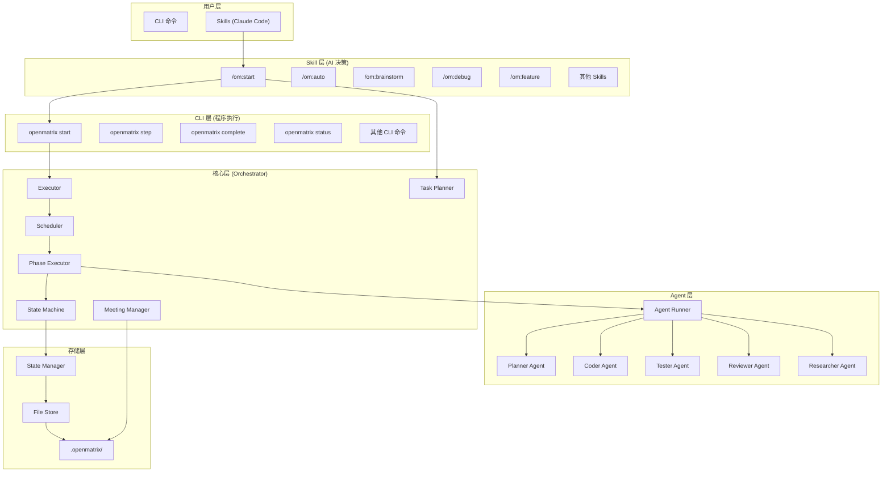
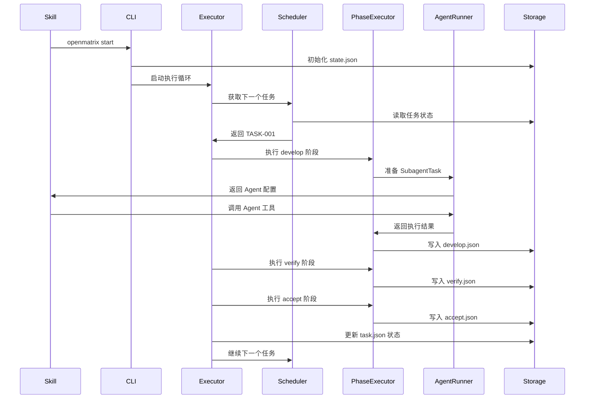
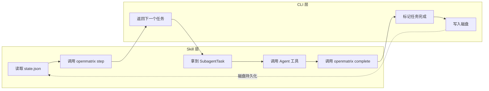
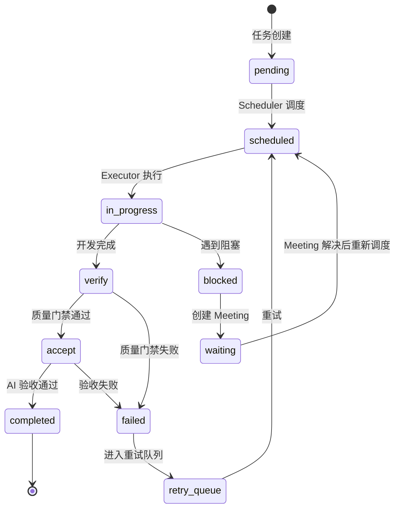

# OpenMatrix 系统架构详解

## 整体架构



---

## 核心组件

### 1. Orchestrator (编排层)

`src/orchestrator/` 目录下的核心组件：

| 文件 | 职责 | 说明 |
|------|------|------|
| `executor.ts` | 主执行循环 | 协调任务分发、状态流转、Agent 调用 |
| `scheduler.ts` | 任务调度 | 依赖解析、优先级排序、并发控制 |
| `phase-executor.ts` | 阶段执行 | develop/verify/accept 三阶段执行 |
| `state-machine.ts` | 状态流转 | Task 状态转换逻辑 |
| `task-planner.ts` | 任务规划 | 从用户输入生成任务分解 |
| `meeting-manager.ts` | Meeting 管理 | 阻塞任务记录和处理 |
| `approval-manager.ts` | 审批管理 | 用户确认点管理 |
| `debug-manager.ts` | 调试管理 | 调试会话生命周期 |
| `interactive-question-generator.ts` | 问题生成 | 交互式问答生成 |
| `environment-detector.ts` | 环境检测 | 项目技术栈自动识别 |

### 2. Agents (Agent 层)

`src/agents/` 目录下的 Agent 实现：

| 文件 | 职责 | 说明 |
|------|------|------|
| `agent-runner.ts` | Agent 运行器 | 准备 SubagentTask，调用 Claude Code Agent 工具 |
| `impl/planner.ts` | Planner Agent | 任务分解、计划生成 |
| `impl/coder.ts` | Coder Agent | 代码编写、功能实现 |
| `impl/tester.ts` | Tester Agent | 测试编写、TDD 流程 |
| `impl/reviewer.ts` | Reviewer Agent | AI 验收、质量确认 |
| `impl/researcher.ts` | Researcher Agent | 领域调研、知识收集 |
| `impl/executor.ts` | Executor Agent | 通用执行 |

### 3. Storage (存储层)

`src/storage/` 目录下的存储组件：

| 文件 | 职责 | 说明 |
|------|------|------|
| `state-manager.ts` | 全局状态管理 | runId、status、config、statistics |
| `file-store.ts` | 文件存储 | JSON 文件读写、原子操作 |

### 4. CLI Commands (命令层)

`src/cli/commands/` 目录下的 CLI 命令：

| 文件 | 命令 | 说明 |
|------|------|------|
| `start.ts` | `openmatrix start` | 启动新任务 |
| `step.ts` | `openmatrix step` | 获取下一个任务 |
| `complete.ts` | `openmatrix complete` | 标记任务完成 |
| `status.ts` | `openmatrix status` | 查看状态 |
| `approve.ts` | `openmatrix approve` | 审批决策 |
| `meeting.ts` | `openmatrix meeting` | 处理阻塞 |
| `resume.ts` | `openmatrix resume` | 恢复中断 |
| `retry.ts` | `openmatrix retry` | 重试失败 |
| `report.ts` | `openmatrix report` | 生成报告 |
| `auto.ts` | `openmatrix auto` | 全自动执行 |
| `brainstorm.ts` | `openmatrix brainstorm` | 头脑风暴 |
| `debug.ts` | `openmatrix debug` | 系统化调试 |
| `research.ts` | `openmatrix research` | 领域调研 |
| `test.ts` | `openmatrix test` | 测试生成 |

---

## 目录结构

```
openmatrix/
├── src/                      # TypeScript 源码
│   ├── orchestrator/         # 核心编排逻辑
│   │   ├── executor.ts       # 主执行循环
│   │   ├── scheduler.ts      # 任务调度
│   │   ├── phase-executor.ts # 阶段执行
│   │   ├── state-machine.ts  # 状态机
│   │   ├── task-planner.ts   # 任务规划
│   │   └── meeting-manager.ts # Meeting 管理
│   ├── agents/               # Agent 实现
│   │   ├── agent-runner.ts   # Agent 运行器
│   │   └── impl/             # 具体 Agent
│   ├── storage/              # 状态持久化
│   │   ├── state-manager.ts  # 全局状态
│   │   └── file-store.ts     # 文件存储
│   ├── types/                # TypeScript 类型
│   │   └── index.ts          # 类型定义
│   ├── cli/                  # CLI 命令
│   │   └── commands/         # 具体命令
│   └── utils/                # 工具函数
├── skills/                   # Claude Code Skills
│   ├── start.md              # /om:start
│   ├── auto.md               # /om:auto
│   ├── brainstorm.md         # /om:brainstorm
│   ├── debug.md              # /om:debug
│   ├── feature.md            # /om:feature
│   ├── research.md           # /om:research
│   ├── status.md             # /om:status
│   ├── approve.md            # /om:approve
│   ├── meeting.md            # /om:meeting
│   ├── resume.md             # /om:resume
│   ├── retry.md              # /om:retry
│   ├── report.md             # /om:report
│   ├── check.md              # /check
│   └── om.md                 # /om (默认入口)
├── docs/                     # 文档
│   ├── FLOW.md               # 执行流程图
│   ├── ROADMAP.md            # 开发路线图
│   ├── ARCHITECTURE.md       # 系统架构
│   └── TERMINOLOGY.md        # 术语对照表
├── tests/                    # 测试文件
├── dist/                     # 编译输出
├── .openmatrix/              # 运行时状态 (执行时生成)
└── package.json              # npm 配置
```

---

## Agent 类型说明

| AgentType | 职责 | 使用场景 |
|-----------|------|----------|
| `planner` | 任务规划 | 分解用户需求、生成执行计划 |
| `coder` | 代码编写 | 功能实现、Bug 修复 |
| `tester` | 测试编写 | TDD 流程、测试生成 |
| `reviewer` | AI 验收 | 验收阶段确认、质量报告生成 |
| `researcher` | 领域调研 | `/om:research` 领域知识收集 |
| `executor` | 通用执行 | 通用任务执行 |

### SubagentTask 结构

Agent Runner 生成的 SubagentTask 配置：

```typescript
interface SubagentTask {
  subagent_type: 'general-purpose' | 'Explore' | 'Plan';
  description: string;      // 简短描述 (3-5 词)
  prompt: string;           // 完整任务提示词
  isolation?: 'worktree';   // 是否使用隔离 worktree
  taskId: string;           // 任务 ID
  agentType: AgentType;     // 原始 Agent 类型
  timeout: number;          // 超时时间 (ms)
  needsApproval: boolean;   // 是否需要审批
}
```

---

## 状态存储机制

### 状态文件结构

```
.openmatrix/
├── state.json              # 全局状态
├── plan.md                 # AI 生成的执行计划
├── tasks-input.json        # 任务输入 (goals, constraints, deliverables)
├── tasks/
│   └── TASK-001/
│       ├── task.json       # 任务定义 + 状态 + 阶段信息
│       ├── context.md      # Agent 上下文 (供后续 Agent 读取)
│       ├── develop.json    # 开发阶段结果
│       ├── verify.json     # 验证阶段结果 (质量门禁)
│       ├── accept.json     # 验收阶段结果
│       └── artifacts/      # 产出文件
├── approvals/              # 审批记录
└── meetings/               # Meeting 记录
```

### GlobalState 结构

```typescript
interface GlobalState {
  version: string;
  runId: string;
  status: RunStatus;
  currentPhase: 'planning' | 'execution' | 'verification' | 'acceptance' | 'completed';
  startedAt: string;
  config: AppConfig;
  statistics: {
    totalTasks: number;
    completed: number;
    inProgress: number;
    failed: number;
    pending: number;
    scheduled: number;
    blocked: number;
    waiting: number;
    verify: number;
    accept: number;
    retry_queue: number;
  };
}
```

---

## 数据流图

### 任务执行数据流



### step/complete 持久化循环



**核心原理**: 执行循环不依赖对话记忆。每次 step 都从磁盘读取状态，complete 后写入磁盘。上下文压缩、崩溃、重启都不影响执行。

---

## 任务生命周期



---

## 分层职责原则

OpenMatrix 的核心思想：**让 AI 做 AI 擅长的事，让 CLI 做 CLI 擅长的事。**

```
Skill 层（AI）          CLI 层（程序）
─────────────────       ─────────────────
理解上下文              收集原始数据
分析权衡                状态持久化
给出推荐理由            执行命令
交互问答                管理任务生命周期
生成配置文件            输出结构化 JSON
```

**CLI 只做两件事：**
1. 收集原始事实（文件存在与否、命令输出、状态数据）
2. 执行明确的操作（运行命令、写入状态、读取文件）

**Skill 层 AI 负责：**
1. 读取原始数据，自行分析和推断
2. 基于上下文给出带理由的推荐
3. 通过 AskUserQuestion 与用户交互
4. 生成配置文件、脚本等产出物

---

## 相关链接

- [返回 README](../README.md)
- [执行流程](FLOW.md)
- [术语对照表](TERMINOLOGY.md)