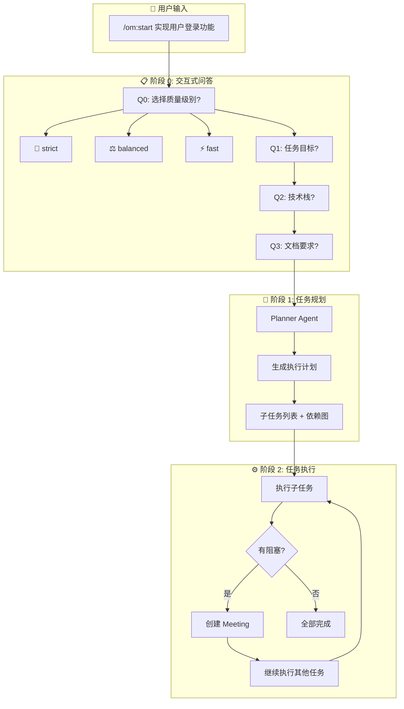
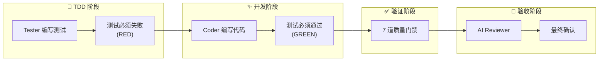
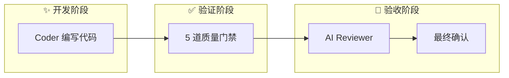
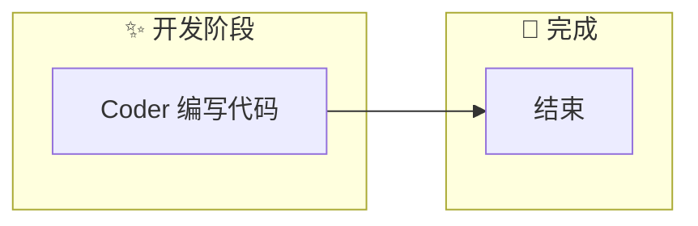
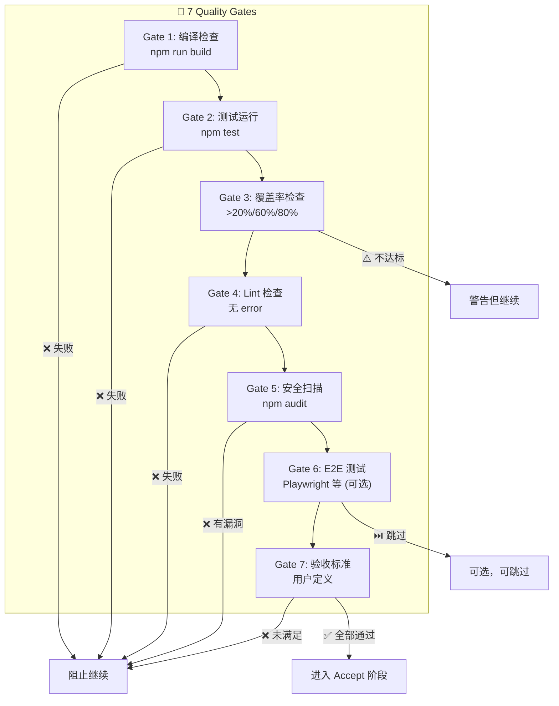
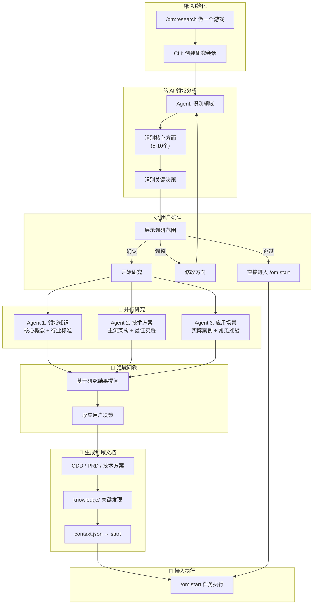
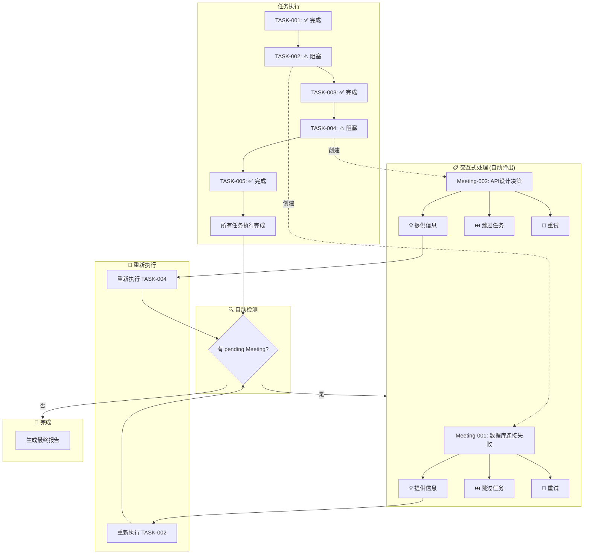
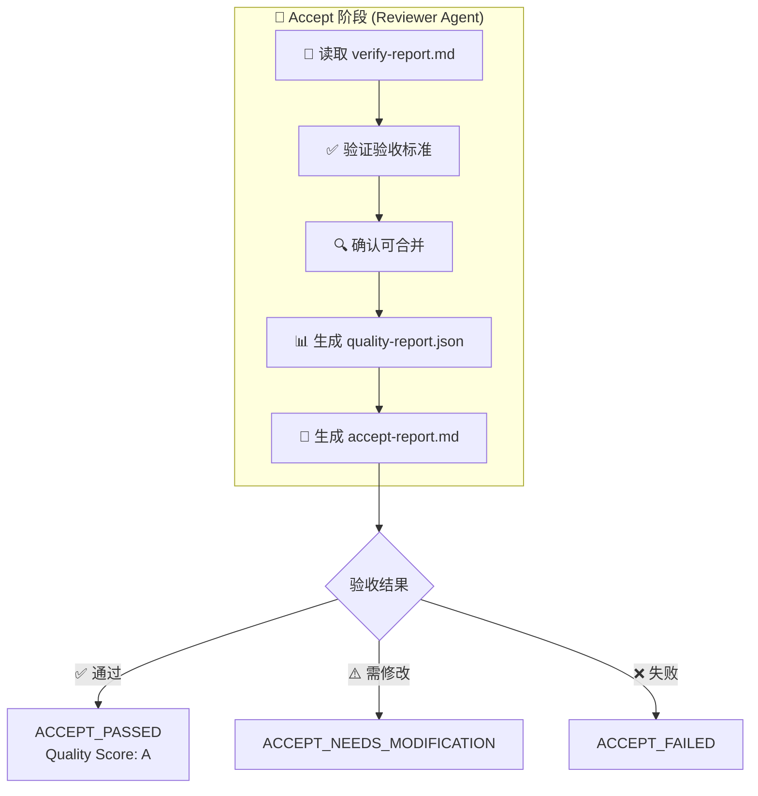
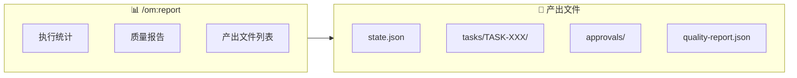
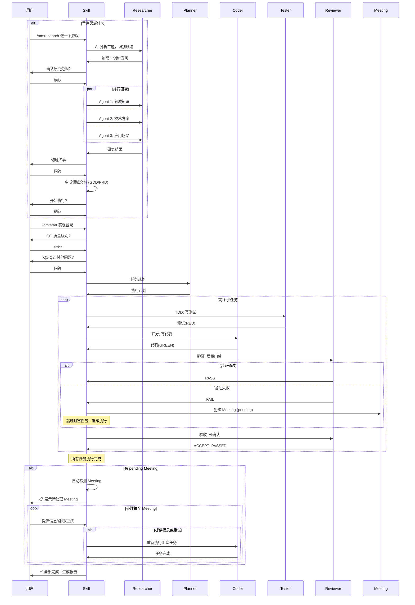

# OpenMatrix 执行流程图

## 完整流程概览



## 质量级别执行流程

### strict 模式 (推荐生产代码)



### balanced 模式 (日常开发)



### fast 模式 (快速原型)



## 七道质量门禁



## Research 调研模式

**适用场景**: 垂直领域任务（游戏开发、支付系统、电商网站等），需要先了解领域知识再执行任务。



### Research 输出文件

```
.openmatrix/research/
├── session.json          # 研究会话状态
├── RESEARCH.md           # 领域专属文档 (GDD/PRD/技术方案)
├── knowledge/
│   ├── finding-1.md      # 关键发现
│   └── finding-2.md
└── context.json          # → start 的任务上下文
```

### 与 brainstorm 的关系

brainstorm 检测到垂直领域时，会建议使用 `/om:research` 进行深度调研，调研完成后再接入 `/om:start` 执行任务。

```
brainstorm → 检测到垂直领域 → suggestResearch → /om:research → /om:start
```

## Meeting 处理流程

**重要**: 任务执行完成后，系统自动检测并处理 Meeting，无需用户手动调用 `/om:meeting`。



## AI 验收流程



## 最终报告



## 完整生命周期



---

## 相关链接

- [返回 README](../README.md)
- [Skills 命令](../skills/)
- [配置说明](../README.md#配置)
