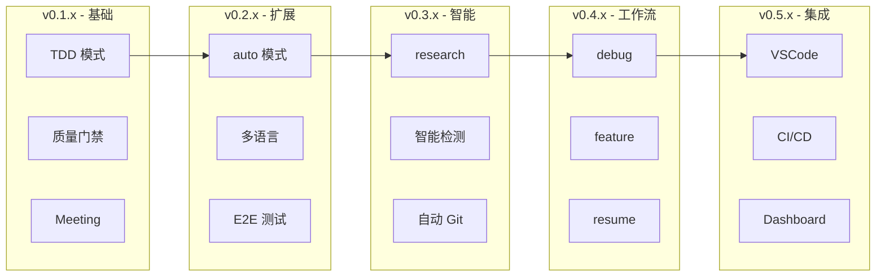

# OpenMatrix 开发路线图

## 版本演进历史

### v0.1.x - 核心功能奠基

| 版本 | 功能 | 描述 |
|------|------|------|
| v0.1.0 | 基础架构 | 任务编排系统框架搭建 |
| v0.1.1 | TDD 模式 | 支持 strict 级别的 TDD 开发流程 |
| v0.1.2 | 质量门禁 | 实现 7 道质量门禁验证机制 |
| v0.1.3 | Meeting 机制 | 非阻塞的任务处理机制 |
| v0.1.4 | 质量报告 | JSON + MD 格式的质量报告生成 |
| v0.1.5 | AI 验收 | Reviewer Agent 最终确认机制 |

### v0.2.x - 执行模式扩展

| 版本 | 功能 | 描述 |
|------|------|------|
| v0.2.0 | `/om:auto` 全自动模式 | 无阻塞、无确认、直接完成 |
| v0.2.1 | `/om:brainstorm` 头脑风暴 | 先探索需求和设计，再执行任务 |
| v0.2.2 | 多语言支持 | Python/Go/Java/TypeScript 等 |
| v0.2.3 | E2E 测试支持 | Web/Mobile/GUI 应用测试 |
| v0.2.4 | Agent 上下文共享 | Agent Memory 跨任务传递 |
| v0.2.5 | Task 子目录结构 | Phase 结果持久化存储 |
| v0.2.6 | 执行循环持久化 | `openmatrix step`/`complete` 防上下文压缩丢失 |

### v0.3.x - 智能化增强

| 版本 | 功能 | 描述 |
|------|------|------|
| v0.3.0 | `/om:research` AI 驱动领域调研 | 垂直领域知识收集和问题探索 |
| v0.3.1 | Git 自动提交 | 任务完成后自动 commit |
| v0.3.2 | Brainstorm/Start 智能状态检测 | 自动识别任务状态 |
| v0.3.3 | AI 目标类型标注 | 智能识别开发/测试/文档任务 |
| v0.3.4 | 系统集成任务 | 多模块自动组装 |
| v0.3.5 | 智能项目检测 | gitignore 根据技术栈自动写入 |
| v0.3.6 | Git 父级目录支持 | 子目录中正常执行 git 操作 |

### v0.4.x - 工作流优化

| 版本 | 功能 | 描述 |
|------|------|------|
| v0.4.0 | `/om:debug` 系统化调试 | 四阶段根因分析 + 自动修复验证循环 |
| v0.4.1 | `/om:feature` 轻量小需求 | 快速迭代，分步 Git 提交 |
| v0.4.2 | `/om:resume` 智能恢复 | 自动检测轻量/完整流程并恢复中断任务 |
| v0.4.3 | `/check` 项目检查 | 自动检测可改进点并提供升级建议 |

---

## 已完成功能

### 核心执行流程

- [x] **TDD 模式** - 先写测试再写代码，确保第一次就写对
- [x] **7 道质量门禁** - 编译/测试/覆盖率/Lint/安全/E2E/验收
- [x] **Meeting 机制** - 阻塞不中断，最后统一处理
- [x] **质量报告** - JSON + MD 双格式报告
- [x] **AI 验收** - Reviewer Agent 最终确认

### 执行模式

- [x] **`/om:auto`** - 全自动执行，适合 CI/CD
- [x] **`/om:brainstorm`** - 头脑风暴，先探索再执行
- [x] **`/om:research`** - AI 驱动领域调研
- [x] **`/om:debug`** - 系统化调试流程
- [x] **`/om:feature`** - 轻量小需求快速迭代
- [x] **`/om:resume`** - 智能恢复中断任务

### 多语言与扩展

- [x] **多语言支持** - Python/Go/Java/TypeScript/Rust 等
- [x] **E2E 测试支持** - Web/Mobile/GUI 应用
- [x] **Agent 上下文共享** - Agent Memory 跨任务传递

### 持久化与可靠性

- [x] **Task 子目录结构** - Phase 结果持久化
- [x] **执行循环持久化** - 防上下文压缩丢失
- [x] **Git 自动提交** - 任务完成后自动 commit

### 智能检测

- [x] **Brainstorm/Start 智能状态检测**
- [x] **AI 目标类型标注**
- [x] **系统集成任务** - 多模块自动组装
- [x] **智能项目检测** - gitignore 自动写入
- [x] **Git 父级目录支持**

---

## 正在开发

- [ ] **运行时隔离** - Worktree 隔离执行环境
- [ ] **测试生成流程改进** - 更智能的测试用例生成
- [ ] **歧义检测增强** - 更精确的需求歧义识别

---

## 未来计划

### 近期计划 (v0.5.x)

- [ ] **VSCode 扩展** - IDE 集成，可视化任务状态
- [ ] **CI/CD 集成** - GitHub Actions/Jenkins 插件
- [ ] **Web Dashboard** - 任务执行可视化界面
- [ ] **多人协作** - 团队任务共享和审批

### 中期计划 (v0.6.x)

- [ ] **插件系统** - 自定义 Agent 和质量门禁
- [ ] **模板库** - 常见任务模板快速启动
- [ ] **知识库集成** - 项目文档和决策历史持久化
- [ ] **性能优化** - 并行任务执行优化

### 远期愿景

- [ ] **跨项目编排** - 多项目依赖管理
- [ ] **AI 自我进化** - 基于历史数据优化执行策略
- [ ] **企业级特性** - 权限管理、审计日志、合规检查

---

## 功能演进趋势

---

## 相关链接

- [返回 README](../README.md)
- [架构详解](ARCHITECTURE.md)
- [执行流程](FLOW.md)